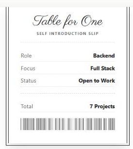
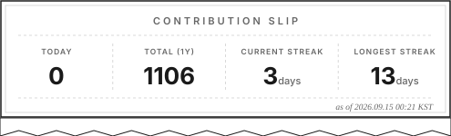

### Kang Suyeon · Backend Developer

작은 불편을 발견하고, 가장 효율적인 방식으로 해결합니다.

doHoaSen.dev 　·　Velog 

 

서비스가 동작하는 이유를 이해하고, 문제 해결 과정을 코드로 설명할 수 있는 개발자를 목표로 합니다.
백엔드를 중심으로 서비스 전반을 이해하는 풀스택 개발자로 성장하는 중입니다.
IT 서비스 기업에서 백엔드 인턴십을 경험했고, 이후로는 사이드 프로젝트로 실력을 쌓고 있습니다.

 

**Skills**

 

**Projects**

- **FinTrack**  — 소비 통계·개인화 피드백·목표 관리를 대시보드 API 하나로 통합 제공하는 가계부 백엔드
- **SpeedNews**  — 여러 언론사 RSS를 SSE로 실시간 스트리밍하는 뉴스 서비스
- **Velog Series Stats**  — Velog 시리즈별 조회수를 집계해주는 크롬 확장 프로그램
- **MCP JobSearch**  — 채용 공고 수집·분석·자기소개서 초안까지 관리하는 개인용 MCP 서버

더 많은 프로젝트는 **Projects Archive**  에서 볼 수 있어요.

 

**Writing**

프로젝트를 만들다 막히거나 새로 알게 된 것들을 Velog에 정리합니다.

📘 velog.io/@tnfdus 

 

